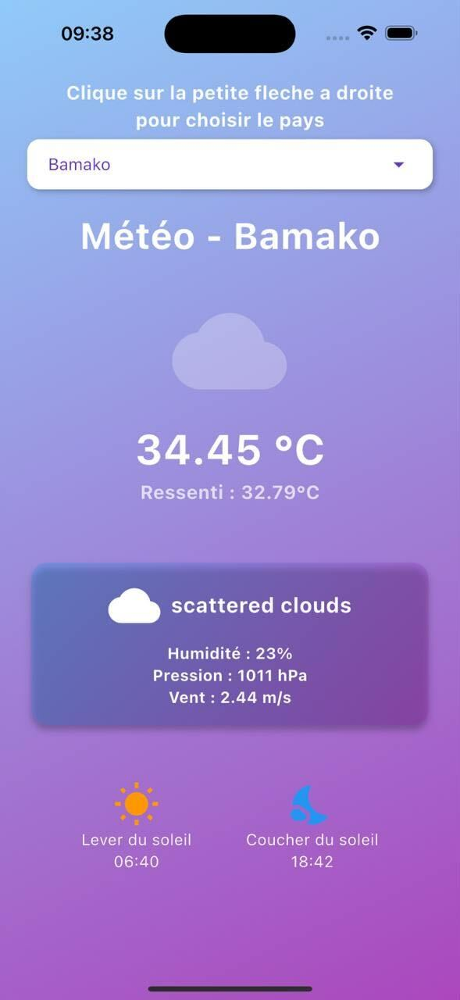
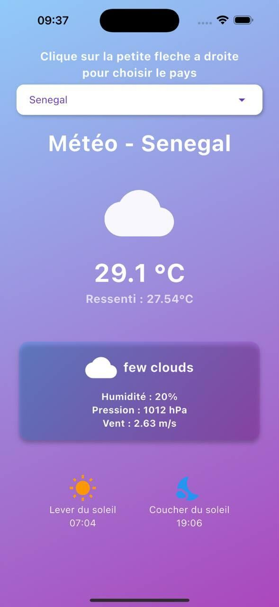
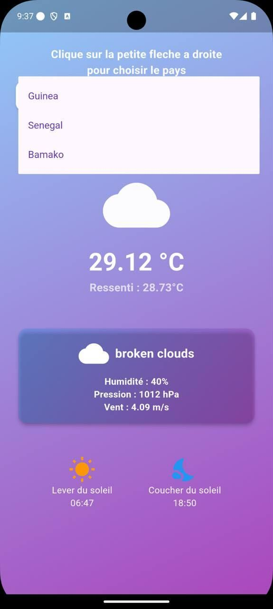
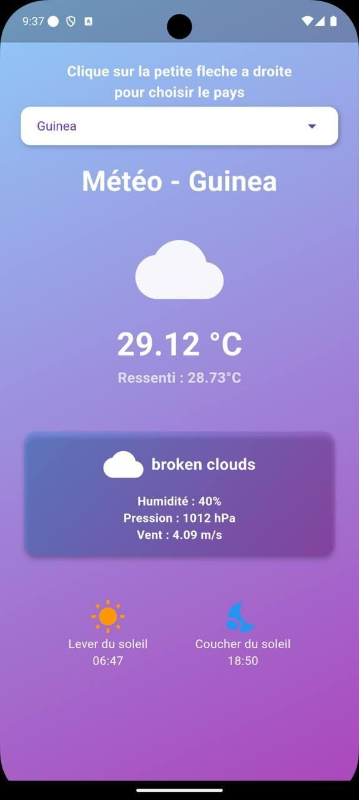

# 🌦️ Exercice : Application Flutter avec l'API OpenWeather

Une application Flutter développée pour intégrer l'API **OpenWeather** — idéale pour les nouveaux étudiants souhaitant apprendre à consommer une API REST en Flutter.

## 📱 Screenshots

### 🟢 Android

### 🍎 iOS

## 🚀 Fonctionnalités

- 🌍 Récupération des données météo en temps réel selon la géolocalisation
- 🎯 Localisation avec `geolocator` et `geocoding`
- 🌈 Animations avec `lottie`
- 🌓 Thème clair/sombre
- 🌐 Formatage des dates avec `intl`
- ⚙️ Appels API HTTP
- 🔄 Architecture simple avec séparation logique (modèles, vues, contrôleurs, services)

## 📦 Packages utilisés

| Package        | Version | Utilité |
|----------------|---------|---------|
| `cupertino_icons` | ^1.0.8 | Icônes style iOS |
| `http`         | ^1.3.0 | Requêtes HTTP |
| `geocoding`    | ^3.0.0 | Conversion coordonnées → adresses |
| `geolocator`   | ^13.0.2 | Accès à la position GPS |
| `lottie`       | ^3.2.0 | Animations JSON |
| `intl`         | ^0.20.2 | Formatage des dates, heures, etc. |

## 🛠️ Getting Started

Quelques ressources utiles si tu débutes avec Flutter :

- [👨‍💻 Lab: Write your first Flutter app](https://docs.flutter.dev/get-started/codelab)
- [📚 Cookbook: Useful Flutter samples](https://docs.flutter.dev/cookbook)
- [📖 Flutter documentation](https://docs.flutter.dev/)

